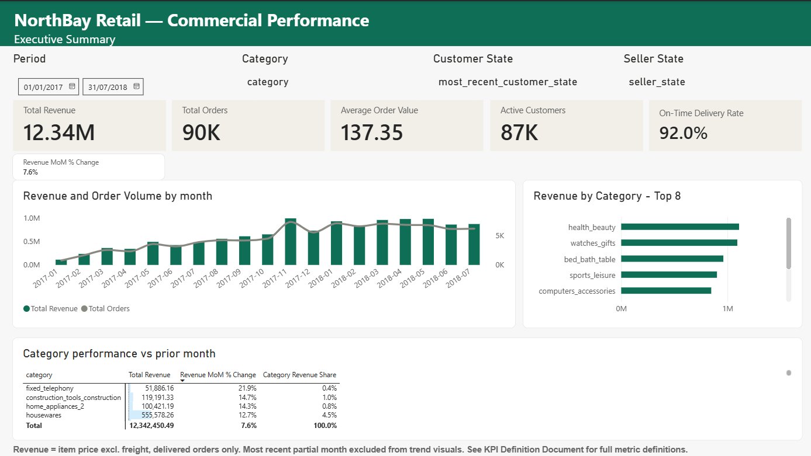
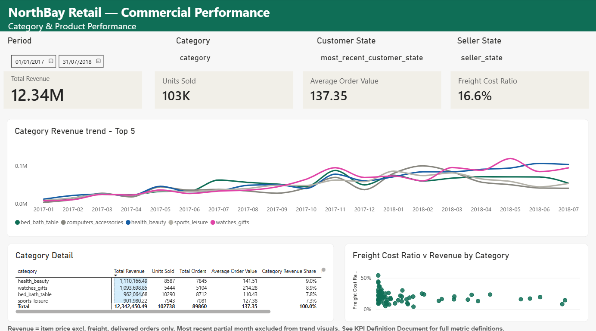
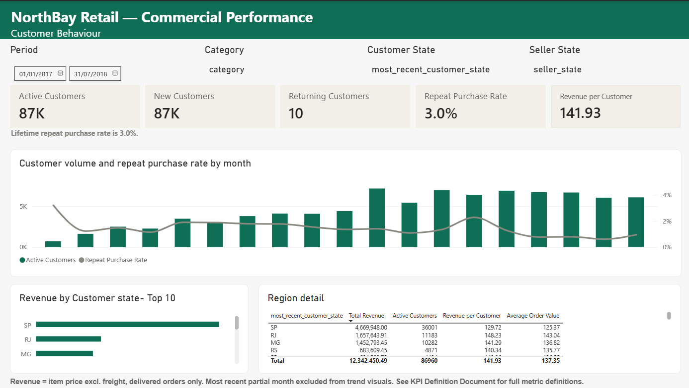
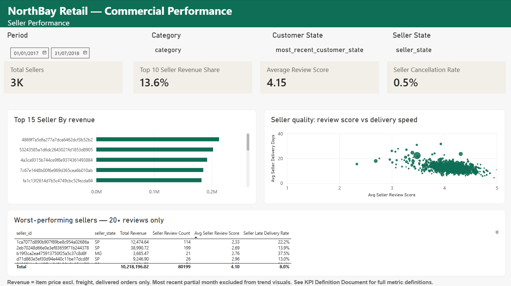
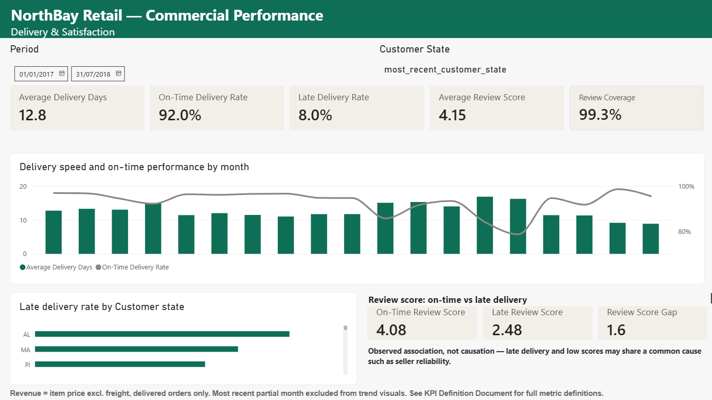

# NorthBay Retail — Commercial Reporting Pack

A monthly commercial reporting solution built end to end: PostgreSQL data warehouse → dimensional model → Power BI report → written findings with recommendations.

**Data source:** [Olist Brazilian E-Commerce public dataset](https://www.kaggle.com/datasets/olistbr/brazilian-ecommerce) — approximately 100,000 orders, 2016–2018.

**NorthBay Retail is a simulated business context**, created to frame this work as a commercial reporting engagement rather than a dataset exploration. The stakeholders, requirements and recommendations are constructed by the author. The data, the analysis and every figure reported are real and reproducible from the public dataset.

---

## Why the project is framed this way

Most portfolio analytics projects stop at a dashboard. The parts that make up much of a reporting analyst's actual work — agreeing metric definitions with stakeholders, documenting data quality decisions, writing up findings a manager can act on — are usually missing, because a raw dataset gives you no stakeholder to agree anything with.

A simulated business context solves that. It makes it possible to write a requirements note, a KPI definition document and a findings memo, and to make the kind of judgement calls those documents force. The technical work is the same either way; the framing is what makes the documentation possible.

---

## Screenshots

All pages shown for the period January 2017 – July 2018.

### Executive Summary
Revenue and order volume trend, category mix, and category performance against the prior month.



### Category & Product Performance
Top-5 category revenue trend, category detail, and freight cost ratio against revenue.



### Customer Behaviour
Customer volume with repeat purchase rate, revenue by state, and regional detail.



### Seller Performance
Top sellers by revenue, a seller quality view (review score against delivery speed, sized by revenue), and the worst-performing sellers with 20+ reviews.



### Delivery & Satisfaction
Delivery speed and on-time performance, late delivery by customer state, and review score by delivery outcome.



---

## Key findings

**Retention is close to zero.** The lifetime repeat purchase rate is 3.0% — 2,801 of 93,358 customers with a delivered order placed more than one. Almost every order comes from a first-time customer, which means current revenue is heavily dependent on continued new-customer acquisition. Repeat rate is sensitive to the time window selected; 3.0% is the lifetime (full-history) figure.

**A high-volume seller is underperforming.** One seller with 114 reviews averages 2.33 stars against a marketplace average of 4.15 — enough volume to rule out a small-sample artefact. The recommendation is investigation, not removal: the data identifies the problem but not its cause.

**Late delivery is associated with substantially lower review scores.** On-time orders average 4.08 stars; late orders average 2.48 — a 1.60-point gap on a five-point scale. With review coverage at 99.33%, review-participation bias is unlikely to explain this gap materially. This is an association, not proof of causation.

Full reasoning, caveats and recommended actions: [`06_findings_memo.md`](06_findings_memo.md).

---

## Technical approach

### Stack

PostgreSQL 18 · pgAdmin 4 · Power BI Desktop · SQL · DAX

Deliberately small. Nothing in the pipeline needed a tool this stack doesn't already provide.

### Architecture

```
Olist CSVs (9 files)
   ↓
olist_raw    — raw tables, loaded as-is
   ↓
olist_stg    — cleaned and standardised, with rejection tables
   ↓
olist_dw     — star schema: 4 dimensions, 3 fact tables
   ↓
Power BI     — 35 DAX measures, 5 report pages
```

### Dimensional model

Star schema rather than a flat table. `Fact_OrderItems` is the primary fact table at order-line grain; `Fact_Orders` holds order-header attributes; `Fact_Reviews` sits at review grain. Four dimensions: Date (generated), Customer, Product, Seller.

All relationships are single-direction, flowing from the one side to the many side. Bi-directional filtering was rejected because it could create ambiguous filter paths across the fact tables and silently produce incorrect results.

Full model: [`03_data_model.md`](03_data_model.md).

---

## Four problems worth reading about

These are the decisions that took the most thought, and the ones most worth discussing.

### 1. The customer key is not the customer

The source system issues a **new `customer_id` for every order**, even for the same physical person. A second column, `customer_unique_id`, is the stable person-level key.

Building `Dim_Customer` on `customer_id` would have made every order look like a first purchase — New Customers would equal Active Customers in every period, Returning Customers would be permanently zero, and the repeat purchase rate would read 0%. Three customer metrics would have been silently meaningless while looking entirely plausible on a dashboard.

The dimension is built at `customer_unique_id` grain. Customer location, which can differ across a person's orders, is taken from their most recent order — a documented decision, not an accident of which row was read first.

Detail: [`04_data_quality_log.md`](04_data_quality_log.md), entries 3.0 and 3.0.1.

### 2. Filters do not travel uphill

With single-direction relationships, `Dim_Seller` and `Dim_Product` reach only `Fact_OrderItems`. They do not reach `Fact_Orders` or `Fact_Reviews`.

The consequence: any measure based on `Fact_Orders` or `Fact_Reviews` is blind to Seller and Category filters. Placed on a seller-level visual, such a measure returns the same global figure for every seller — which is exactly what happened. The seller quality scatter first rendered as a flat horizontal line, because every seller was being assigned the marketplace-wide average delivery time.

The fix is `TREATAS`: capture the order IDs visible in the current filter context from `Fact_OrderItems`, then apply that list as a filter on the target fact table. Six measures use this pattern — five seller-level measures, documented alongside the order-level versions they duplicate, and `Reviewed Orders`, which needs it so that Review Coverage compares matching populations under any filter.

The remaining delivery and review measures are order-level by design: an order may contain items from several categories and sellers but is delivered and reviewed once. The Category and Seller State slicers are removed from the Delivery & Satisfaction page rather than left to appear functional while doing nothing.

Detail: [`02_kpi_definitions_v2.1.md`](02_kpi_definitions_v2.1.md), sections 3 and 4.

### 3. A documented assumption that turned out to be wrong

The KPI document originally stated that reviews were voluntary and covered only a subset of orders — the standard pattern for customer feedback, and the basis for a caveat on every review-based metric.

Testing it in SQL returned **95,832 reviewed orders against 96,478 delivered = 99.33%**. The Power BI measure returned the same figure independently.

The assumption was wrong, and the documentation was corrected rather than quietly adjusted. This materially strengthened the delivery finding: with coverage at 99.33%, review-participation bias is unlikely to explain the gap materially. Why coverage is this high is not determinable from the data and is not claimed.

Detail: [`04_data_quality_log.md`](04_data_quality_log.md), entry 6.2.

### 4. Small bases produce misleading percentages

The Executive Summary's category table was originally sorted by month-on-month revenue change. The top rows were categories with around 1,000 BRL of revenue showing changes above +250% — two or three extra orders producing a headline figure.

Filtering those categories out of the visual would have fixed the ranking but broken reconciliation: the table total would no longer match the page's Total Revenue card. The solution is to suppress the metric rather than the row. `Revenue MoM % Change (Material)` returns blank for categories below 50,000 BRL of revenue in the period. Every category stays in the table, the total still reconciles to 12.34M, and the biggest movers among material categories rise to the top.

The same pattern handles seller review scores: `Avg Seller Review Score` is suppressed for sellers with fewer than 20 reviews. Both thresholds are judgement calls, documented as such, rather than derived figures.

Detail: [`02_kpi_definitions_v2.1.md`](02_kpi_definitions_v2.1.md), sections 1 and 3.

---

## Repository contents

| File | What it is |
|---|---|
| [`01_requirements_note.md`](01_requirements_note.md) | Stakeholders, business questions, scope, assumptions, success criteria |
| [`02_kpi_definitions_v2.1.md`](02_kpi_definitions_v2.1.md) | All 35 measures: business definition, DAX, grain, watch-outs, filter scope |
| [`03_data_model.md`](03_data_model.md) | Star schema, table definitions, relationships |
| [`04_data_quality_log.md`](04_data_quality_log.md) | Issues found, treatment rules, reasoning, downstream effects |
| [`05_powerbi_report_design.md`](05_powerbi_report_design.md) | Page-by-page report specification |
| [`06_findings_memo.md`](06_findings_memo.md) | Findings, recommendations, limitations |
| [`sql_01_staging.sql`](sql_01_staging.sql) | Raw → staging: cleaning rules and rejection tables |
| [`sql_02_dimensions_and_facts_postgres.sql`](sql_02_dimensions_and_facts_postgres.sql) | Staging → warehouse: star schema build |
| [`sql_03_business_queries.sql`](sql_03_business_queries.sql) | Business questions answered directly in SQL |
| [`NorthBay_Commercial_Reporting.pbix`](NorthBay_Commercial_Reporting.pbix) | Final Power BI report and data model |
| [`images/`](images/) | Report page screenshots |

---

## Reproducing this

1. Download the Olist dataset and load the nine CSVs into a PostgreSQL schema named `olist_raw`
2. Run `sql_01_staging.sql` to build the cleaned staging layer in `olist_stg`
3. Run `sql_02_dimensions_and_facts_postgres.sql` to build the star schema in `olist_dw`
4. Connect Power BI to `olist_dw` in Import mode, load the seven tables, set the six relationships per the data model, and mark `Dim_Date` as the date table
5. Create the measures from the KPI definition document
6. Build the pages from the report design specification

Validation queries are included at the end of both SQL scripts. Row counts and total revenue should reconcile between the warehouse and the report.

---

## What this project does not do

Stated up front so the scope is clear:

- **No profitability analysis.** Cost-of-goods data is not in the source, so no finding addresses margin.
- **No acquisition cost or lifetime value analysis.** Marketing spend and acquisition cost are not available, so acquisition efficiency and customer lifetime value are not assessed.
- **No causal claims.** The pack is descriptive and diagnostic. Where a relationship is reported, it is an observed association.
- **No forecasting or predictive modelling.** Out of scope by design.

---

**Author:** Sayanth Rajani Divakaran · MSc Data Analytics
